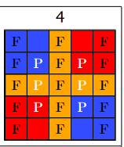
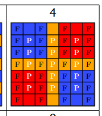
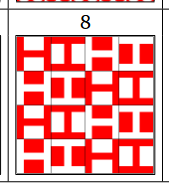
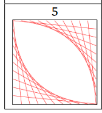

# M30299 Programming
Python Coursework (Module Assessment Item 3): A Patchwork Maker

- [Coursework PDF on Moodle](https://moodle.port.ac.uk/pluginfile.php/4208137/mod_resource/content/5/PythonPatchworkCoursework.pdf)
- [Submission Area](https://moodle.port.ac.uk/mod/assign/view.php?id=3074374)

## Patches
### 4 (Anepenultimate)

### 8 (Penultimate)

### 5 (Final)
